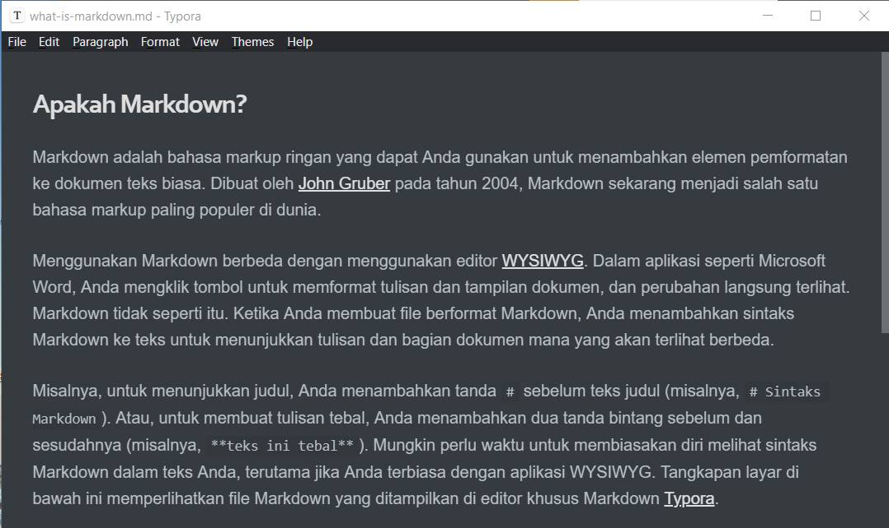

## Apakah Markdown?

Markdown adalah bahasa *markup* ringan yang dapat Anda gunakan untuk menambahkan elemen pemformatan ke dokumen teks biasa. Dibuat oleh [John Gruber](https://daringfireball.net/projects/markdown/) pada tahun 2004, Markdown sekarang menjadi salah satu bahasa *markup* paling populer di dunia.

Menggunakan Markdown berbeda dengan menggunakan editor [WYSIWYG](https://en.wikipedia.org/wiki/WYSIWYG). Dalam aplikasi seperti Microsoft Word, Anda mengklik tombol untuk memformat tulisan dan tampilan dokumen, dan perubahan langsung terlihat. Markdown tidak seperti itu. Ketika Anda membuat file berformat Markdown, Anda menambahkan sintaks Markdown ke teks untuk menunjukkan tulisan dan bagian dokumen mana yang akan terlihat berbeda.

Misalnya, untuk menunjukkan judul, Anda menambahkan tanda `#` sebelum teks judul (misalnya, `# Sintaks Markdown`). Atau, untuk membuat tulisan tebal, Anda menambahkan dua tanda bintang sebelum dan sesudahnya (misalnya, `**teks ini tebal**`). Mungkin perlu waktu untuk membiasakan diri melihat sintaks Markdown dalam teks Anda, terutama jika Anda terbiasa dengan aplikasi WYSIWYG. Tangkapan layar di bawah ini memperlihatkan file Markdown yang ditampilkan di editor khusus Markdown [Typora](https://typora.io).

  

Anda dapat menambahkan elemen pemformatan Markdown ke file teks ASCII menggunakan aplikasi editor teks. Atau, Anda dapat menggunakan salah satu dari banyak aplikasi Markdown untuk sistem operasi macOS, Windows, Linux, iOS, dan Android. Terdapat juga beberapa aplikasi berbasis web yang dirancang khusus untuk menulis file Markdown.

Bergantung pada aplikasi yang Anda gunakan, Anda mungkin tidak dapat mem-pratinjau dokumen yang diformat secara langsung. Hal itu tidak mengapa, karena menurut  [Gruber] (https://daringfireball.net/projects/markdown/), sintaks Markdown dirancang agar dapat dibaca dan tidak mengganggu, sehingga teks dalam file asli Markdown tetap dapat dibaca meskipun belum diproses.

> Tujuan Markdown adalah membuat dokumen yang memuat sintak untuk memformatnya, namun naskah aslinya tetap terbaca semaksimal mungkin. Ide dasarnya adalah bahwa dokumen Markdown harus dapat diterbitkan dari naskah aslinya apa adanya (tanpa diubah sedikitpun), sebagai teks biasa, tanpa terlihat seperti telah ditamabah dengan tag atau perintah-perintah pemformatan.
